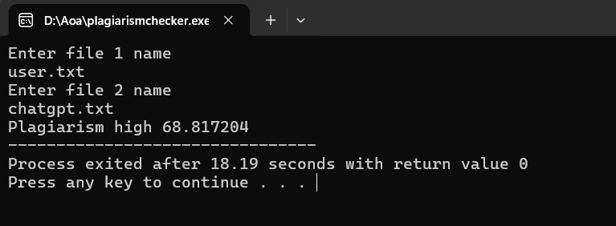

# 📄 Plagiarism Checker (LCS-Based)


A simple command-line tool written in C that estimates how similar two text files are by using the **Longest Common Subsequence (LCS)** algorithm. It reads the content of two files, compares them, and outputs a similarity percentage along with a basic verdict on whether the similarity level is high.

This tool is intended as an introductory or educational example of applying dynamic programming (LCS) to a text-comparison problem, rather than a production-grade plagiarism detection system.

---

## 📑 Table of Contents

- [Demo](#demo)
- [Compilation Instructions](#compilation-instructions)
- [How to Run the Program](#how-to-run-the-program)
- [How It Works: Core Logic](#how-it-works-core-logic)
- [Limitations & Potential Improvements](#limitations--potential-improvements)
- [Disclaimer](#disclaimer)

---

## Demo

<!--
  Add a screenshot or short screen recording (GIF) of the program running
  in a terminal here. Save it to an `assets/` folder in your repo.
-->


*(Replace the placeholder above with an actual screenshot of the program running in your terminal, saved to an `assets/` folder in your repository.)*

---

## Compilation Instructions

The program is written in standard C and can be compiled using any standard C compiler.

1. Open a terminal in the directory containing the source file.
2. Run the following compilation command, replacing the placeholders with your actual compiler and desired output name:

```bash
[YOUR_C_COMPILER] plagiarism_checker.c -o [EXECUTABLE_NAME]
```

**Example** (using GCC):

```bash
gcc plagiarism_checker.c -o plagiarism_checker
```

> **Note:** The program uses variable-length arrays (VLAs) to build the comparison table, so ensure your compiler supports this C feature (most modern compilers, including GCC and Clang, do by default).

---

## How to Run the Program

Once compiled, run the executable from your terminal:

```bash
./[EXECUTABLE_NAME]
```

The program will prompt you interactively for two file names:

1. **Enter file 1 name** — Type the name (or path) of the first text file you want to compare, then press Enter.
2. **Enter file 2 name** — Type the name (or path) of the second text file, then press Enter.

### Expected Input

* Two plain text files that already exist and are accessible from the location where you run the program.
* Each file's content is read as a **single line** — the program reads up to the first newline character (or up to the buffer limit) from each file. Text spanning multiple lines beyond the first will not be read.
* The maximum number of characters read from each file is defined by a buffer size of **10,000 characters**. Any content beyond this limit in a single line will be ignored.

### Expected Output

After processing, the program prints one of two possible results to the terminal:

* If the calculated similarity is **greater than 50%**, it prints a message indicating **"Plagiarism high"** along with the exact percentage.
* If the similarity is **50% or lower**, it prints the calculated **plagiarism percentage** without the "high" label.

The output includes the similarity value as a decimal number representing a percentage.

---

## How It Works: Core Logic

### 1. Text Normalization — `tolowercase`

Before comparison, both text inputs are converted entirely to lowercase using the `tolowercase` function. This ensures that the comparison is **case-insensitive** — meaning words like "Plagiarism" and "plagiarism" are treated as identical. Without this step, differences in capitalization alone could unfairly lower the similarity score.

### 2. Longest Common Subsequence — `LCS`

The heart of this program is the `LCS` function, which calculates the **Longest Common Subsequence** between the two text strings.

* A *subsequence* is a sequence of characters that appears in the same relative order in both strings, but not necessarily contiguously (i.e., there can be gaps).
* The `LCS` function uses **dynamic programming**: it builds a table (a 2D array) where each cell represents the length of the longest common subsequence found so far between portions of the two strings.
* The final value in this table (bottom-right corner) gives the total length of the longest subsequence shared by both texts.

This approach allows the program to detect similarity even when the matching text isn't in the exact same position or format, as long as the character order is preserved.


### 3. Similarity Calculation

Once the LCS length is known, the program calculates a similarity percentage using the following formula:

```
similarity = (2.0 * lcsstr / (str1 + str2)) * 100
```

Where:

* **`lcsstr`** — the length of the Longest Common Subsequence found between the two texts.
* **`str1`** — the length of the first text (after lowercase conversion).
* **`str2`** — the length of the second text (after lowercase conversion).

This formula is conceptually similar to a **Dice coefficient**: it doubles the shared content length and divides it by the combined length of both texts, producing a percentage that reflects how much of the total content is shared between the two files.

### 4. Verdict Threshold

The program uses a simple fixed threshold:

* **Similarity > 50%** → Flagged as **"Plagiarism high"**
* **Similarity ≤ 50%** → Reported as the plain similarity percentage

---

## Limitations & Potential Improvements

This implementation is a straightforward demonstration of the LCS algorithm and has several limitations worth noting:

* **Single-line reading**: The file-reading function only reads a single line (up to the first newline) from each file. Multi-line documents will not be fully compared, as content after the first line break is ignored.
* **Fixed buffer size**: Text is limited to 10,000 characters per file. Larger documents will be truncated, which could lead to inaccurate similarity results.
* **No input validation on comparison length**: If both input files happen to be empty, the similarity formula could involve dividing by zero, which may produce undefined or unexpected results.
* **No whitespace or punctuation normalization**: The program only normalizes case; it does not remove punctuation, extra spaces, or handle synonyms/paraphrasing, which can affect accuracy.
* **Character-level comparison only**: LCS is applied at the character level rather than the word or sentence level, which may not capture meaningful similarity in cases of paraphrased or reordered content.
* **Fixed similarity threshold**: The 50% threshold for flagging "high" plagiarism is hard-coded and not configurable or based on any calibrated standard.
* **Interactive input only**: File names must be entered manually at runtime; there is no support for passing file paths as command-line arguments.


